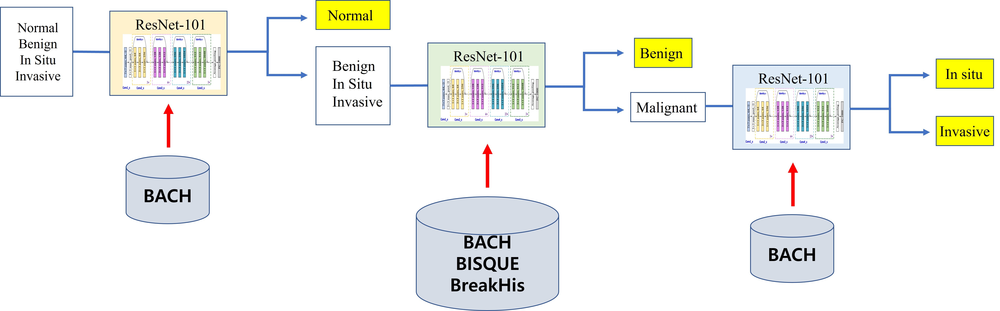
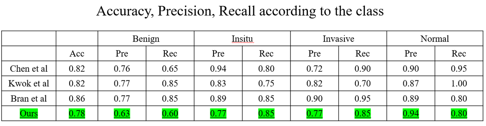
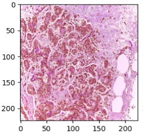
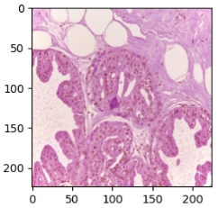
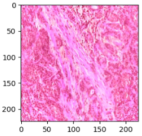
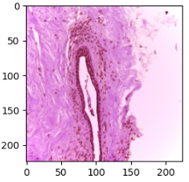
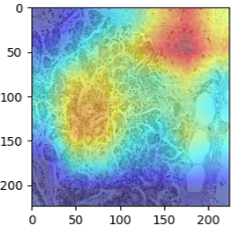
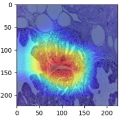
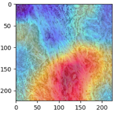
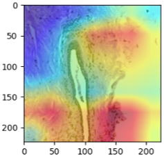

# DATASET
Datasets are pathology images of breast cancers.

There are four classes (Normal, Benign, In situ, Invasive).

Dataset can be downloaded in [[link]](https://iciar2018-challenge.grand-challenge.org/).

**Train data**

    bach_data
        ├── normal_train
        │     ├──── normal_001.tif
        │     ├──── normal_002.tif
        │     ├──── normal_003.tif
        │     ├──── ...
        │
        └── normal_train
            ├──── benign_001.tif
            ├──── benign_001.tif
            ├──── benign_001.tif
            ├──── ...

**Test data**

    bach_data
        └── test
              ├──── test_001.tif
              ├──── test_002.tif
              ├──── test_003.tif
              ├──── ...


# Network



We used three different model. The three models take a hierarchical form.

**First model : Normal vs Rest (Benign, In situ, and Invasive) classifier**

**Second model : Benign vs Malignant (In situ, Invasive) classifier**

**Third model : In situ vs Invasive classifier**

Second model task (Benign vs Malignant classifier) is very challenging.

So we use external dataset (BISQUE, BreakHis) to enlarge our dataset.


# Training

Input Size : 224x224

Batch Size : 4

Number of epoch : 50

Augmentation : Random Horizontal Flip, Random Rotation, Random Scaling


# Result



# Grad-CAM Result

## Original Image
| Normal                            | Benign                        | In situ                            | Invasive                     |
| ----------------------------- | ----------------------------- | ----------------------------- | ----------------------------- |
|    |    |    |    |

## Grad-CAM
| Normal                            | Benign                        | In situ                            | Invasive                     |
| ----------------------------- | ----------------------------- | ----------------------------- | ----------------------------- |
|    |    |    |    |

# Run Example
```
Train
$ cd code/BACH_challenge
$ python3 train.py --stage First
$ python3 train.py --stage Second
$ python3 train.py --stage Third

Test
$ cd code/BACH_challenge
$ python3 test.py --stage Test
```